## IDEA使用

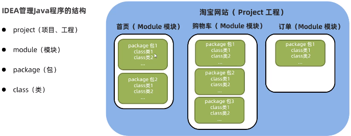

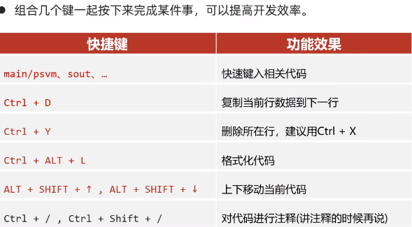

## 包

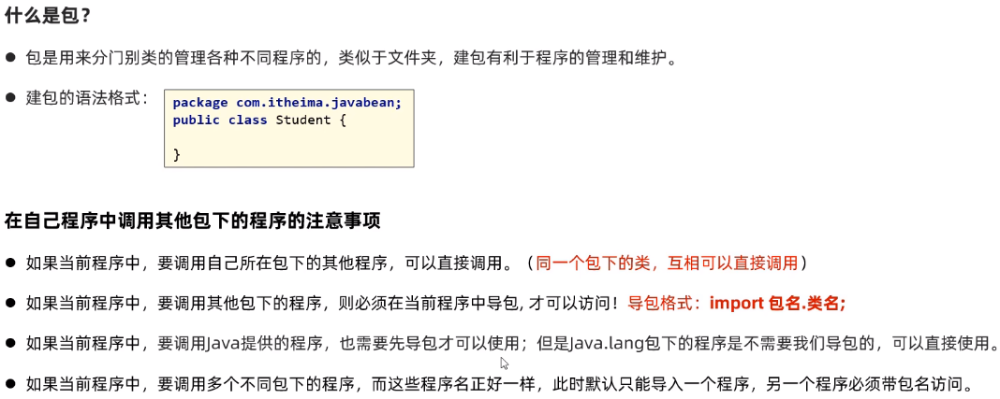

## 面向对象：

### 继承：

单继承，多层继承，每个类多继承于Object

构造方法不能继承

成员变量：非私有能

成员方法：虚方法表（非 private，static, final）的可以

### **访问：**

成员变量：就近原则

重写：子类重写父类成员方法@override

### this, super 使用总结

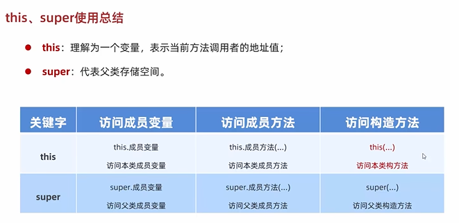

### 多态

**什么是多态**

同类型的对象，表现出不同的形态

**多态的表现形式**

父类类型 对象名称 = 子类对象

**多台的前提**

1. 有继承关系
2. 有父类引用指向子类对象
3. 有方法重写

作用：父类做形参，可以用传递父类所有的子类

调用成员变量的特点：编译看左边，运行也看左边

调用成员方法的特点：编译看左边，运行看你右边

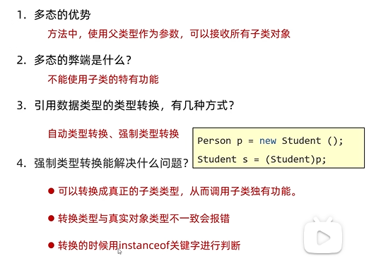

# 包

包就是文件夹，用来管理各种不同功能的java类

包名的规则：公司域名的反写 + 包的作用，需要小写

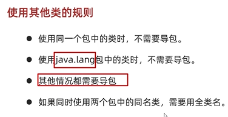

## final

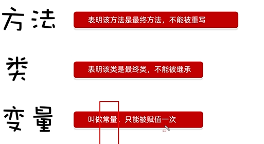

通常用于定义常量

## 权限修饰符

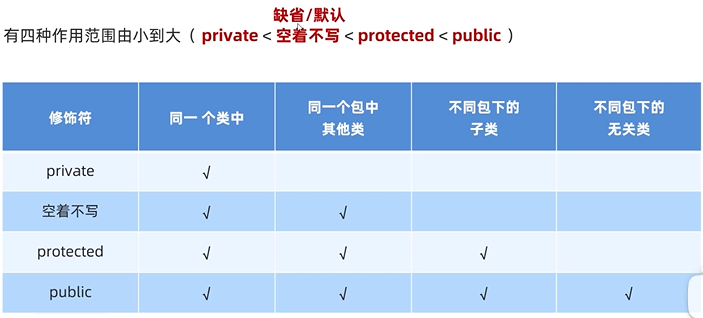

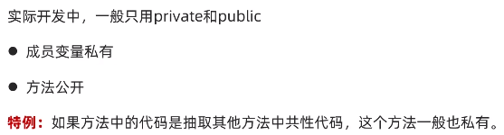

### 代码块

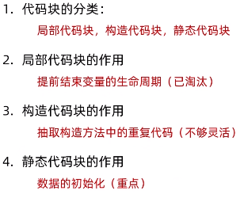

### 抽象类

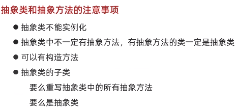

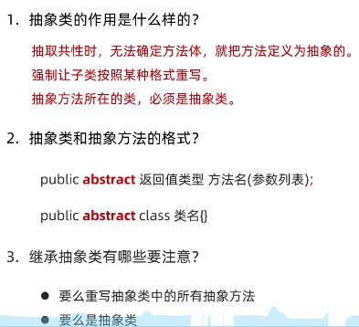

### 接口

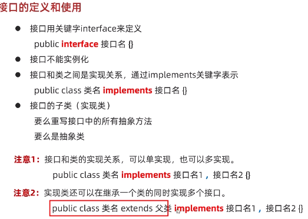

### 内部类

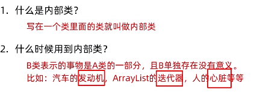

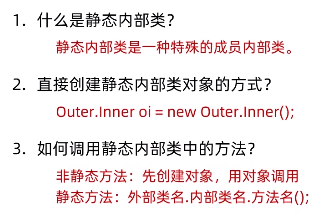

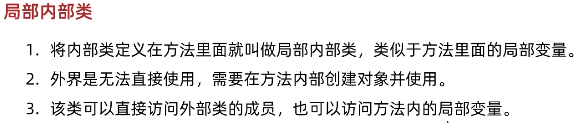

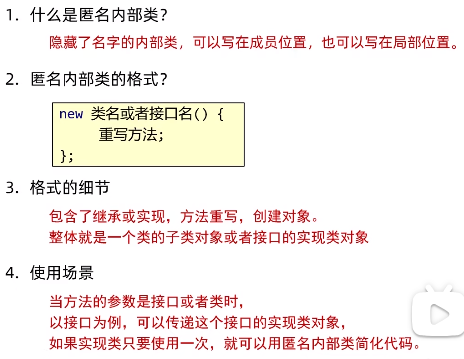
